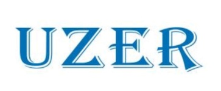

<!-- {% include carousel.html height="50" unit="%" duration="7" number="1" %} -->

# DALI: The 2nd MICCAI Workshop on Data Augmentation, Labeling, and Imperfections

With the proliferation of data-intensive methods for supervised learning, the demand for large quantities of annotated data has never been higher. Unfortunately, large-scale collections of medical images are exceptionally challenging to collect and require rare and expensive expertise to annotate. Moreover, medical data are often noisy and imperfect due to missing entries and sensing heterogeneity. A forum for discussing contemporary and practical approaches for dealing with these challenges is urgently needed.

The MICCAI Workshop on **D**ata **A**ugmentation, **L**abeling, and **I**mperfections (**DALI**) aims to provide a venue for researchers to present and discuss their experiences working on these important topics.

## Important Dates

- **[Paper Submission](https://cmt3.research.microsoft.com/DALI2022) Opens**: April 3rd, 2022
- **Paper Submission Deadline**: ~~June 27th~~ **July 2nd**, 2022
- **Notification to Authors**: ~~July 20th~~ **July 25th**, 2022
- **Camera Ready Deadline**: ~~July 30th~~ **August 3rd**, 2022
- **Workshop Day**: September 22th, 2022

## Call For Papers

Training machine learning systems for image recognition, object detection, and image segmentation often requires a tremendous amount of expert annotated data to reach a high level of accuracy. Having a large number of labeled images helps increase the performance of machine learning models by generalizing better and thereby reducing overfitting. This requirement is even more significant for cutting-edge learning architectures such as vision transformers. As a result, the most popular benchmark datasets for general image recognition tasks have tens of thousands to millions of images.

Unfortunately, obtaining such vast amounts of labeled data is very challenging in the medical imaging domain due to costly annotation by domain experts and the lack of high-quality anonymized data out of privacy concerns. Furthermore, there are unique challenges to collecting annotated medical datasets. For instance, although hard to obtain, examples of rare pathological conditions are extremely important for an accurate representation of the data distribution. Moreover, there are often variations among experts who provide labels, especially for conditions that human experts are most confused about and need help the most.

The goal of this workshop is to bring together and create a discussion forum for researchers in the MICCAI community, including those
i) who are interested in the rigorous study of medical data as it relates to machine learning systems,
ii) who are developing and promoting novel directions of research in such techniques,
iii) who would like to contribute benchmark datasets, open challenges, and tasks that enable fair comparisons among existing and new techniques, and
iv) who are applying such techniques to improve the performance of medical image computing systems.
The workshop will have invited speakers presenting popular and emerging data augmentation and contemporary approaches for learning from small and noisy medical data. The workshop welcomes submissions that present new ideas, new results, new datasets, as well as discussion and evaluation of existing approaches. The topics of interest include but are not limited to:

- Training and evaluation with noisy or uncertain labels
- Data annotation tools and practices
- Synthetic data for medical image analysis
- One-shot/few-shot learning
- Active learning
- Semi-, weakly-, self-supervised learning
- Deep learning for small, noisy and imperfect data
- Domain adaptation/generalization
- Erroneous label detection
- Data curation
- Principles and/or case studies of annotated datasets and benchmarks
- Anonymization, PHI detection
- Other related topics

Submissions to our workshop will be managed using the same platform as the main MICCAI conference, using the Microsoft CMT. Workshop paper submission website is at: [https://cmt3.research.microsoft.com/DALI2022](https://cmt3.research.microsoft.com/DALI2022)

DALI workshop will employ the same reviewing standards as the main conference. DALI workshop paper submissions should be anonymized in order to accommodate a double blind review. Papers should be formatted using LaTeX or MS Word templates available at [Lecture Notes in Computer Science](https://www.springer.com/gp/computer-science/lncs/conference-proceedings-guidelines). Manuscripts should be up to 8-pages (text, figures and tables) plus up to 2 pages of references. In submitting a paper, authors implicitly acknowledge that no paper of substantially similar content has been or will be submitted to another conference or workshop until the decisions have been made by our workshop. Supplemental material submission is optional, which may include:

- Videos of results that cannot be included in the main paper
- Anonymized related submissions to other conferences and journals
- Appendices or technical reports containing extended proofs and mathematical derivations that are not essential for the understanding of the paper

Contents of the supplemental material should be referred to appropriately in the paper and that reviewers are not obliged to look at it.

<!--
## Camera Ready Guidelines
Please try your best to address the comments from reviewers and submit to the [DALI CMT site](https://cmt3.research.microsoft.com/DALI2022) the following materials as a single zip archive named `dali22_id-X.zip` where X is replaced by your paper ID:

- Your manuscript up to 8.5 pages (text, figures and tables) plus up to 2 pages of references (`manuscript.pdf`)
- Any supplementary material (`supplementary_material.pdf` – optional, source files are not required)
- A document indicating any changes that were made after review (`changes_after_review.pdf`)
- The [copyright form](https://dali-miccai.github.io/DALI22_SNCS_ProceedingsPaper_LTP_ST_SN_Switzerland.docx) signed by the corresponding author. Digital signature is not acceptable. (`copyright.pdf`)
- A folder named `src/` with the source files for your manuscript (`.tex`, `.bib` etc., or `.docx`)

In order to present your paper at MICCAI DALI 2022, at least one author of the paper **must** register to attend the second workshop day on September 22. DALI workshop will be in hybrid mode this year. This registration does not need to be an “in-person” registration. The camera ready submission form will ask you for the registration number for the author who will be presenting your paper. 
 -->

## Paper Presentation Guidelines

Each accepted paper will be given 11 minutes for presentation and Q&A. In-person presentations are highly recommended, but remote virtual presentations can be accommodated. Please complete the survey form (https://docs.google.com/forms/d/112VBP1Zft_LDDIPivIcRXPJvsMF4POx31o10zRUQfkU) to inform the workshop organizers about your presentation format (in-person or remote) and the presenter of your paper

Every accepted paper should upload the presentation slides in .pptx format. If your paper will be presented virtually, you are also required to upload a video of your presentation that is 8-9 minutes in length. Authors presenting in-person are strongly recommended to upload a video but they are not required to do so. Please name your files with a prefix that is your DALI22 paper id, e.g. dali22_id-X.pptx where X is replaced by your paper ID. The powerpoint slides and videos should be uploaded to the following Google Drive folder, no later than Monday, September 19th:
https://drive.google.com/drive/folders/1vZE40Eq9XV2yr_SwZtP6UlzdA4BXgaIh

Please note that you may be asked to sign into one of your google accounts before accessing and uploading files to the folder above. If you encounter difficulty with login, please email Sharon Huang (suh972@psu.edu) and ask for an alternative way of uploading files.

## Program

### Keynote Speakers
- Yefeng Zheng, Tencent Jarvis Lab, China
- Daniel Rueckert, Technical University of Munich, Germany and Imperial College London, UK
- Ehsan Adeli, Stanford University, USA
- Vishal M. Patel, Johns Hopkins University, USA
- Zhen Li, The Chinese University of Hong Kong, Shen Zhen, China

### Panelists
- Chen Chen, Imperial College London, UK
- Lequan Yu, University of Hong Kong, Hong Kong
- Kelvin Wong, Houston Methodist Hospital, USA

## People

### Co-Chairs

- Hien V. Nguyen, University of Houston, USA
- Sharon Xiaolei Huang, The Pennsylvania State University, USA
- Yuan Xue, Johns Hopkins University, USA

<!-- ### Editorial Chairs -->

<!-- ### Award Committee -->
<!-- - Dimitris N. Metaxas, Rutgers University, USA -->

### Advisory Board
- Dimitris N. Metaxas, Rutgers University, USA
- Stephen Wong, Houston Methodist Hospital, USA
- Nicholas Heller, University of Minnesota, USA
- S. Kevin Zhou, University of Science and Technology, China
- Jia Wu, MD Anderson Cancer Center, USA
- Ehsan Adeli, Stanford University, USA

### Program Committee

- Amogh Subbakrishna Adishesha, The Pennsylvania State University
- Ti Bai, UT Southwestern Medical Center
- Weidong Cai, University of Sydney
- Nicha Dvornek, Yale University
- Christoph M. Friedrich, University of Applied Sciences and Arts Dortmund
- Michael Goetz, German Cancer Research Center
- Nicholas Heller, University of Minnesota
- Mahdi Hosseini, University of New Brunswick
- Edward Kim, Drexel University
- Xiao Liang, UT Southwestern Medical Center
- Kefei Liu,  University of Pennsylvania
- Haomiao Ni, The Pennsylvania State University
- Hui Qu, Adobe Inc.
- Emanuele Trucco, University of Dundee
- Jiarong Ye, The Pennsylvania State University
- Chenyu You, Yale University
- Pengyu Yuan, University of Houston
- Samira Zare, University of Houston
- Xingyu Li, University of Alberta
- Chen Yang, City University of Hong Kong
- Gilbert Lim, National University of Singapore
- Luyang Luo, The Chinese University of Hong Kong
- Yubo Fan, Vanderbilt University
- Zuhui Wang, Stony Brook University

### Sponsors

Prizes for **best paper and best paper honorable mention** awards are sponsored by [Rulai](https://rul.ai/), [Uzer](http://www.uzerhn.com/) and [United Imaging](https://www.uii-ai.com/en)

<!--[Histosonics graphic](https://histosonics.com/wp-content/uploads/2020/03/histosonics_ogimage.jpg) -->
